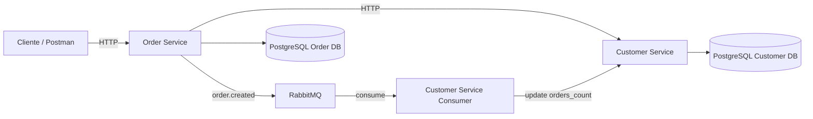

# 📘 Juan Guauque Backend Challenge

Este repositorio contiene un sistema backend distribuido desarrollado con **Ruby on Rails**, diseñado como parte de una prueba técnica para el rol de Backend Developer. 

El sistema utiliza una arquitectura de microservicios que combina comunicación síncrona vía HTTP y comunicación asíncrona mediante **RabbitMQ**.


---

## 🧱 Arquitectura del Sistema

El ecosistema está desacoplado en servicios independientes con persistencia propia:

* **🧑 Customer Service**: 
    * Gestiona la información de los clientes.
    * Mantiene el contador `orders_count`.
    * Consume eventos de pedidos para actualizar estadísticas.
* **📦 Order Service**: 
    * Gestiona el ciclo de vida de los pedidos.
    * Consulta a *Customer Service* para validar datos en tiempo real.
    * Publica eventos `order.created` tras cada registro exitoso.
* **🐇 RabbitMQ**: Message Broker que facilita la comunicación desacoplada.
* **🗄️ PostgreSQL**: Cada servicio cuenta con su propia base de datos, asegurando el aislamiento de datos.

---

## 🔄 Flujo de Comunicación

### 1️⃣ Creación de pedidos (Síncrono)
`Cliente` → `Order Service` → `Customer Service`
* *Order Service* consulta a *Customer Service* para validar al cliente.
* Los datos obtenidos enriquecen la respuesta de la API pero **no** se persisten en el servicio de pedidos.

### 2️⃣ Evento de pedido creado (Asíncrono)
`Order Service` → `RabbitMQ` → `Customer Service (Consumer)`
* Al crear un pedido, se emite el evento.
* El consumidor en *Customer Service* procesa el mensaje e incrementa el campo `orders_count`.

--- 

## 📊 Diagrama de Arquitectura



---

## 🚀 Ejecución del Proyecto

### Requisitos
* **Docker** y **Docker Compose**.
* No es necesario instalar dependencias locales (Ruby, Rails o DB).

### Instalación y Arranque
Ejecuta el siguiente comando en la terminal:

```bash
docker compose up --build
```

Este proceso automatizado incluye:

* Levantamiento de infraestructura (Postgres y RabbitMQ).

* Preparación de base de datos (db:prepare).

* Ejecución automática de Seeds 🌱 para pruebas inmediatas.

* Manejo de resiliencia: El consumidor espera y reintenta la conexión hasta que RabbitMQ está listo.

---

## 📡 Servicios Disponibles
| Servicio | URL |
|---|---|
| Customer Service | http://localhost:3000 | 
| Order Service | http://localhost:3001 |
| RabbitMQ UI | http://localhost:15672 (User: `guest` / Pass: `guest`)

--- 

## 🧪 Ejemplo de API (Crear Pedido)

```bash
curl -X POST http://localhost:3001/orders \
  -H "Content-Type: application/json" \
  -d '{
    "order": {
      "customer_id": 1,
      "product_name": "Laptop",
      "quantity": 1,
      "price": 1200,
      "status": "created"
    }
  }'
```

### Respuesta esperada
```bash
{
    "id": 2,
    "product_name": "Laptop",
    "status": "created",
    "customer": {
        "id": 1,
        "name": "Juan Guauque",
        "addres": "Bogotá",
        "order_count": 2
    }
}
```

---

## 🛠️ Tecnologías Utilizadas
* Ruby 3.4.x & Rails (API Mode)

* PostgreSQL (Persistencia)

* RabbitMQ (Comunicación asíncrona)

* Docker & Docker Compose (Contenerización)

---

## 👤 Autor
Juan Sebastián Guauque Torres